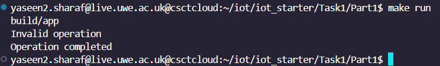
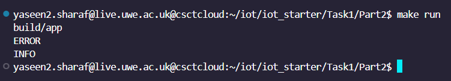
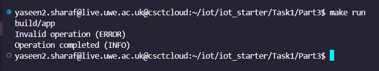
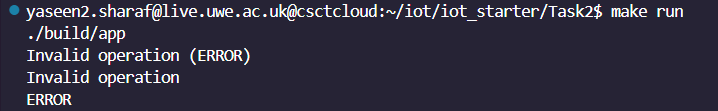
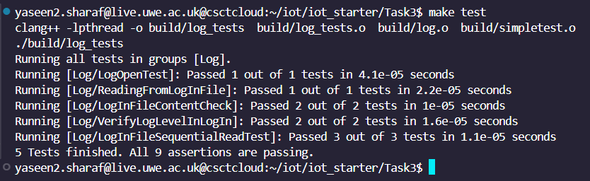

# IOT  Project Worksheet#1

This project explores foundational Internet of Things (IoT) concepts, specifically targeting log file management and the enhancement of testing methods. It is structured into three progressive tasks aimed at gradually enhancing the project's functionality and robustness.To initiate the project setup on your personal computer for development and test purposes, follow these instructions. Essential requirements include a compiler that supports C++17 standards (options include g++ or clang++) and Make for compiling the project. For testing functionalities, you will also need the SimpleTest framework, which comes as a submodule within the project.

## Setting Up the Project Locally

To get started with the project on your local environment, follow these steps:

1. **Clone the Project Repository**

   Begin by cloning the project to your local machine. Open a terminal and run the following command:

   ```bash
   git clone https://gitlab.uwe.ac.uk/y2-sharaf/iot_starter 
   ```
2. **Navigate to the Project Directory**

   After cloning, move into the project directory with this command:
   
   ```bash
   cd iot_starter
   ```
3. **Initialize and Update the Submodule**

   The project includes the SimpleTest framework as a submodule. To initialize and update it, execute:

    ```bash
    git submodule init
    git submodule update
    ```


## Task 1: Introduction to Log File Management


This initial task involves a straightforward C++ program tailored for log file management, showcasing the ability to both extract and read log entries as well as output their contents directly to the terminal. The task is segmented into three distinct parts, each with a specific focus, enhancing the program's functionality in handling log files progressively.

### Launching The Application

   **1.Compile the Project**: Utilize the `make` command to compile the project and this command reads the Makefile in the current directory and executes the build instructions specified within it.


   **2.Run the Application**: To run the application, execute it by using the command `./build/app`, which initiates the application's operations by calling the app's executable found within the build directory. Alternatively, you can simply use `make run` to start the application.


## Part 1:

### Full Implementation:

```C++
#include <iostream>
#include <fstream>
#include <string>

// Process each log line to extract the message part
std::string line(const std::string& logLine) {
    size_t startPos = logLine.find(": ") + 2; // Find the start position of the message part
    if (startPos != std::string::npos) { // Check if the delimiter was found
        return logLine.substr(startPos); // Return the message part of the log line
    }
    return ""; // Return an empty string if the delimiter is not found
}

void processLogFile(const std::string& fileName) {
    std::ifstream logFile(fileName);
    std::string logLine;
    // Check if the log file opened successfully
    if (!logFile.is_open()) {
        std::cerr << "Unable to open log file" << std::endl;
        return;
    }
    // Read each line from the log file
    while (getline(logFile, logLine)) {
        std::string message = line(logLine); // Corrected function call to 'line' to process each log line
        std::cout << message << std::endl; // Output the processed log message
    }
    // Close the log file
    logFile.close();
}
int main() {
    processLogFile("log.in"); // Call the processLogFile function with a sample log file name
    return 0;
}

   ``` 

### Anticipated Result for a Specific Log Line:


## Part 2 Extracting Log Level

### Full Implementation:


```C++
#include <iostream>
#include <fstream>
#include <string>

// Extracts the log level from a log line (text between square brackets)
std::string extractLogLevel(const std::string& logLine) {
    size_t startPos = logLine.find('[') + 1; // Find the start of the log level
    size_t endPos = logLine.find(']'); // Find the end of the log level
    if (startPos != std::string::npos && endPos != std::string::npos && startPos < endPos) {
        // Extract and return the log level if both delimiters are found and correctly positioned
        return logLine.substr(startPos, endPos - startPos);
    }
    return ""; // Return an empty string if the log level cannot be extracted
}

// Processes each line of the specified log file to extract and print log levels
void processLogFile(const std::string& fileName) {
    std::ifstream logFile(fileName);
    std::string logLine;

    // Check if the log file was successfully opened
    if (!logFile.is_open()) {
        std::cerr << "Unable to open log file" << std::endl;
        return;
    }

    // Read each line from the file and extract the log level
    while (getline(logFile, logLine)) {
        std::string message = extractLogLevel(logLine);
        std::cout << message << std::endl;
    }

    // Close the file to release resources
    logFile.close();
}
int main() {
    processLogFile("log.in"); // Example log file name
    return 0;
}

   ```
### Anticipated Result:


## Part 3: Log Line Reformatting and Output

### Full Implementation:

```C++
#include <iostream>
#include <fstream>
#include <string>

// Reformats a log line by extracting and rearranging its parts
std::string reformatted(const std::string& logLine) {
    size_t startPos = logLine.find("[") + 1; // Start of log level
    size_t endPos = logLine.find("]"); // End of log level
    size_t Pos = logLine.find(": ") + 2; // Start of the main log message

    if (startPos != std::string::npos && endPos != std::string::npos && startPos < endPos && Pos != std::string::npos) {
        // Ensure all positions are valid before proceeding
        std::string messageLevel = logLine.substr(startPos, endPos - startPos); // Extract log level
        std::string messageContent = logLine.substr(Pos); // Extract main message
        return messageContent + " (" + messageLevel + ")"; // Return reformatted line
    }
    // Return the original line if the expected format is not found
    return logLine;
}

// Processes the specified log file, reformatting and printing each line
void processLogFile(const std::string& fileName) {
    std::ifstream logFile(fileName);
    std::string logLine;

    // Check for successful file opening
    if (!logFile.is_open()) {
        std::cerr << "Unable to open log file" << std::endl;
        return;
    }

    // Read and process each line of the file
    while (getline(logFile, logLine)) {
        std::string message = reformatted(logLine);
        std::cout << message << std::endl; // Print the reformatted log line
    }

    // Close the file once done
    logFile.close();
}
int main() {
    processLogFile("log.in"); // Example usage with a sample log file
    return 0;
}

   ``` 
#### Expected Output for Given Log Line



## Task 2: Enhanced Log Analysis and Verification


Building upon Task 1, this stage advances the log file analysis by introducing enhanced features into the log processing application, effectively merging previously isolated components into a cohesive system through the integration of log.hpp, log.cpp, and main.cpp. This evolution not only streamlines the application's operations but also marks a significant leap in its capabilities, incorporating refined log analysis techniques for efficient parsing and data extraction from complex log formats. The system is structured around the Log class, defined in log.hpp and implemented in log.cpp, with main.cpp serving as the driver program that leverages this class to facilitate sophisticated log file processing.

### Function Implementation Details: main.cpp

 ```C++
#include "log.hpp"

int main() {
    Log log;
    if (log.create_log("log.in")) {
        while (log.next()) {
        std::cout << log.reformat() << std::endl;
        std::cout << log.level() << std::endl;
        std::cout << log.line() << std::endl;

    }
    }else {
        std::cerr << "Failed to open log file." << std::endl;
    }
    return 0;
}

   ```
### Launching The Application

   **1.Compile the Project**: Utilize the `make` command to compile the project and this command reads the Makefile in the current directory and executes the build instructions specified within it.


   **2.Run the Application**: To run the application, execute it by using the command `./build/app`, which initiates the application's operations by calling the app's executable found within the build directory. Alternatively, you can simply use `make run` to start the application.

### Anticipated Results:



## Task 3 Enhanced Testing and Resilience Enhancement


In this phase, attention is directed towards enhancing the application's testing framework established in Task 2, as well as fortifying its resilience through the integration of advanced error management techniques. By expanding the testing suite to include a wider range of test cases, such as edge cases and less typical scenarios, the application's ability to adeptly process an extensive variety of inputs and efficiently navigate diverse situations is significantly bolstered. Simultaneously, the implementation of sophisticated error handling strategies markedly enhances the application's robustness, effectively safeguarding against crashes and eradicating unpredictable behavior to ensure consistent and stable operation under any unexpected conditions.

## Test Execution Instructions

To compile and initiate the unit tests, deploy the following command: `make test`. This instruction compiles the test suite and runs the tests, systematically reporting any discrepancies and confirming the integrity of all application components. For a more thorough testing process, activate the comprehensive test suite with:` ./build/log_tests`. Executing this command launches an extensive series of tests, meticulously examining each test's outcome and pinpointing any sections necessitating further scrutiny.


##  All Five Tests

### Test 1:

```C++
 // Test 1: Successfully opening a log file
DEFINE_TEST_G(LogOpenTest, Log) {
    Log log;
    // Test opens the log.in file assuming it exists
    bool success = log.create_log("log.in");
    TEST_MESSAGE(success == true, "Failed to open log file!");
}
   ```

### Test 2:

```C++
  // Test Case 2: Reading from Log File
DEFINE_TEST_G(ReadingFromLogInFile, Log) {
    Log log;
    log.create_log("log.in"); // Ensure the "log.in" file exists and contains at least one line for the test
    bool success = log.next();
    TEST_MESSAGE(success, "Should be able to read from the 'log.in' file.");
}

   ```

### Test 3:

```C++
 // Test Case 3: Confirming 'log.in' File Contains Data
DEFINE_TEST_G(LogInFileContentCheck, Log) {
    Log log;
    // Open 'log.in', assuming it exists for this scenario
    bool openSuccess = log.create_log("log.in");
    TEST_MESSAGE(openSuccess, "Failed to open 'log.in'; file does not exist or is inaccessible.");

    // Attempt to read from 'log.in' to confirm it contains data
    bool readSuccess = log.next();
    TEST_MESSAGE(readSuccess, "'log.in' is empty or could not be read, expected to contain data.");
}
   ```

### Test 4:

```C++
// Test Case 4: Verifying Correct Log Level Extraction
DEFINE_TEST_G(VerifyLogLevelInLogIn, Log) {
    Log logProcessor; // Create a log processing instance
    // Initiates opening of 'log.in', expected to contain log entries for this test
    bool isLogOpened = logProcessor.create_log("log.in");
    TEST_MESSAGE(isLogOpened, "Opening 'log.in' failed, cannot proceed with log level identification test.");

    // Proceed if there's at least one entry to analyze for a log level
    if (logProcessor.next()) {
        std::string detectedLogLevel = logProcessor.level(); // Attempt to pinpoint the log level in the current log entry
        TEST_MESSAGE(!detectedLogLevel.empty(), "Log level identification in 'log.in' resulted in an empty string.");
        // Further assertions could include checking the detected log level against expected values, enhancing test robustness
    } else {
        TEST_MESSAGE(false, "No entries available in 'log.in' for log level identification.");
    }
}
   ```

### Test 5:

```C++
// Test 5: Verifying 'log.in' File's Readability After Initial Read
DEFINE_TEST_G(LogInFileSequentialReadTest, Log) {
    Log log;
    // Open 'log.in' for the test
    bool openSuccess = log.create_log("log.in");
    TEST_MESSAGE(openSuccess, "'log.in' failed to open on the first attempt.");

    // Read the first line to simulate initial use
    bool initialReadSuccess = log.next();
    TEST_MESSAGE(initialReadSuccess, "Initial read from 'log.in' failed, cannot proceed with sequential read test.");

    // Attempt to read a second line, verifying continued readability
    bool continuedReadSuccess = log.next();
    TEST_MESSAGE(continuedReadSuccess, "Failed to read from 'log.in' after an initial read, expected sequential readability.");
}
   ```


## Test Execution Results

Below is an example of the output you might see when running the test suite for the project:



